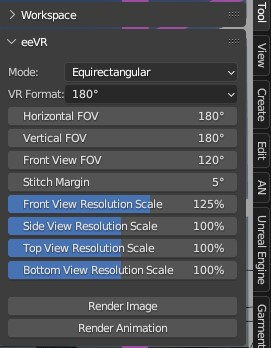
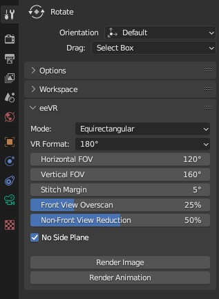

# eeVR

Blender addon to render 360° and 180° images and videos in eevee engine with support for stereoscopic rendering.

## Getting Started

You will need to get [**Blender 3.x**](https://www.blender.org), install it, download the zip file from this GitHub,
load the addon into Blender by installing the zip file in Blender Preferences > Add-ons > Install,
search for "eeVR" under the Community tab and click the checkbox to enable it.
A tool panel will appear in the 3D Viewport's **Tool tab**, FOV value adjustment, and buttons for rendering stills and animations.
**The rendered images/image sequences will be stored in the same directory as the .blend file**.

**NOTE** : The eeVR panel appears only when the render engine is EEVEE or WORKBENCH.

 

### Stitch Margin

An angle for seam blending.

Stitch Margin = 5°

 +  = 

Final Image

### Resolution scales per view

The resolution is calculated so that the angle of view of each camera (front, back, top, bottom, and side) fits the final rendering resolution,
but in this case the panorama is stretched and the front center is not resolved enough.

The resolution can be increased by this amount only for the frontal rendering to compensate for the lack of resolution.

The default setting of 125% almost eliminates the lack of resolution in the center of the image,
but it results in excessive resolution on the periphery.

This means that rendering will take more time.

Meanwhile, To reduce rendering time, you can specify the reduction percentage of the rendering resolution for views other than the front view,
where their importance is lower.

You can set it from 1% to a maximum of 200% reduction.

### Front View FOV

You can specify a field of view (FOV) greater than 90° but less than 160° exclusively for the front view.

Since rendering the front view is typically crucial, having a wider FOV for the front view in a single rendering pass can push the boundaries with other
views to the corners of the field of view, improving quality.

If the front view FOV is greater than the horizontal FOV, the side view rendering is omitted. Similarly, if it's greater than the vertical FOV,
the top and bottom views' rendering is omitted. If both conditions are met, the front view rendering occurs only once.
In this case, the FOV is clipped to whichever is larger between the horizontal and vertical FOVs.

**NOTE** : This feature is active only in VR180 mode.

### Applies Parallax For Side And Rear

When enabled, it allows for noticeable seams or blending artifacts in side and rear views' margins to introduce collect parallax at over HFOV 180 rendering.

This switch only available if Horizontal FOV greater than 180° and stereo rendering is active.

### 'Top is RightEye' switch

When enabled, in 'Top-Bottom' mode of stereo rendering, the right-eye image is positioned above.

By default, when it's turned off, the left-eye image is placed above, and the right-eye image is positioned below.

By the way, in the side-by-side mode, you can swap the left and right by checking the "Cross-Eyed" option in the Output Properties.

## License

This project is licensed under the GNU General Public License v3.0 - see the [LICENSE.md](LICENSE.md) file for details.

## Acknowledgments

- The image conversion OpenGL shader was originally created by [Xyene](https://github.com/Xyene) and modified for use in Blender so thank you.

### Original Founder

[EternalTrail](https://github.com/EternalTrail)
